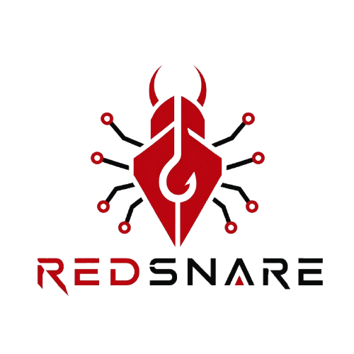

# RedSnare: Decentralized Bug Bounty Platform

<p align="center">
  
</p>

> **Status:** MVP Complete .

RedSnare is a production-ready decentralized bug bounty platform built with **Foundry**, **Next.js**, and **Wagmi**. It leverages blockchain technology to solve the trust issues inherent in centralized bug bounty platforms (opacity, payment delays, and arbitrary triage).

The platform allows organizations to create decentralized bug bounties where security researchers can securely submit encrypted vulnerabilities, get judged by appointed committees, and get paid according to strict SLAs and automated escalation paths.

---

## 🚀 Key Features

### 🏗️ Smart Contracts (Foundry)
- **Fully On-Chain Bounties**: Create bounties with configurable rewards, stakes, deadlines, and multi-sig committee sizes.
- **Secure Encrypted Submissions**: Enforces commit-reveal workflows with AAD (Additional Authenticated Data) WebCrypto encryption. Only the designated committee can decrypt the final reveal.
- **Robust Dispute Resolution**:
  - Direct committee accept/reject phase.
  - Dispute/Escalate Phase (requiring appeal bonds).
  - Secret Commit/Reveal flow for committee voting to prevent group-think.
- **Sybil Resistance & Reputation System**: 
  - Tracks researcher interactions (Disputes Won/Lost, Rejects/Accepts).
  - Uses an exponential temporal decay function for reputation metrics natively inside the EVM.
  - Dynamically adjusts stake requirements based on user reputation to prevent spam.
- **Security First**: Complete integration of CEI (Checks-Effects-Interactions) patterns, explicit insolvency checks, and Reentrancy guards.

### 💻 Frontend (Next.js + Wagmi + Viem)
- **Dynamic Dashboard**: Real-time interaction with the blockchain state (no centralized backend).
- **Researcher Portal**: Secure local encryption of reports, IPFS storage via Pinata, and on-chain submission.
- **Committee Interface**: Dedicated workflow for reviewing, voting, and resolving disputes.
- **Dispute UI**: Automated escalation paths when SLAs are missed.

---

## 📁 Project Structure

- **`/contracts`**: Foundry project containing Solidity smart contracts, deployment scripts, and an extensive test suite.
- **`/frontend`**: Next.js application using Tailwind CSS and Wagmi for Web3 interactions.
- **`/docs`**: Technical specifications, threat models, and architectural diagrams.
- **`launch.sh`**: One-click script to start a local environment (Anvil node + Deploy + Frontend).

---

## 🛠️ Quick Start (Local Development)

The easiest way to start the project is using the provided launcher script:

```bash
# Make sure you have Foundry and Node.js installed
chmod +x launch.sh
./launch.sh
```

This script will:
1. Start a local **Anvil** node.
2. Deploy the **Smart Contracts**.
3. Initialize and start the **Frontend** development server.

### Manual Installation

#### 1. Smart Contracts
```bash
cd contracts
forge install
forge build
forge test
```

#### 2. Frontend
Create a `.env.local` inside the `/frontend` directory:
```env
NEXT_PUBLIC_PINATA_JWT=your_pinata_jwt_here
NEXT_PUBLIC_CONTRACT_ADDRESS=your_deployed_contract
NEXT_PUBLIC_MOCK_USDC_ADDRESS=your_deployed_mockusdc
```
Then run:
```bash
cd frontend
npm install
npm run dev
```

---

## 🧪 Testing

The contracts are battle-tested with comprehensive invariant and unit fuzzing logic:

```bash
cd contracts
forge test -vvv
```

Tests cover:
- Core bounty lifecycle (Creation -> Submission -> Review -> Payout).
- Reputation decay math and stake escalations.
- Commit-Reveal voting integrity.
- Security boundaries (Reentrancy, Insolvency, Access Control).

---

## 🔒 Security Posture

RedSnare addresses critical vulnerabilities found in traditional platforms:
1. **Front-running Protection**: Domain-separated encryption bindings (AAD) prevent replay attacks.
2. **Funds Safety**: Isolated **Escrow** module ensures that bounty rewards are locked and only distributable via verified protocol outcomes.
3. **Anti-Spam**: On-chain rate-limiting and reputation-based staking requirements.

---

